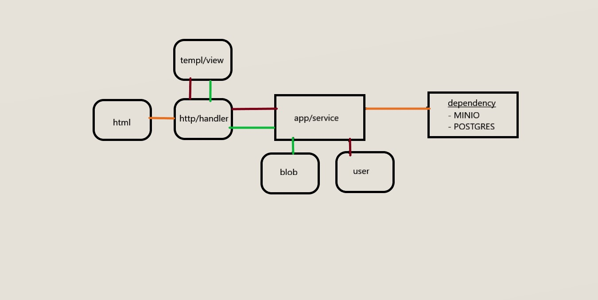

# cloud storage

 

## Getting Started

#### start the container
```
docker compose up -d
```
command will pull dependency image (postgres, minio, caddy) and also build image of the app from Dockerfile

visit "localhost:2080" in browser. to manage the uploaded file it can access from "localhost:9090", it is the minio admin dashboard, admin username and password defined in `compose` file. for more [minio-website](https://min.io)

#### stop the container
```go
docker compose down -v
```

### Architecture
the architecture is rather simple , it use postgres for store user account and minio for store object (files) 

